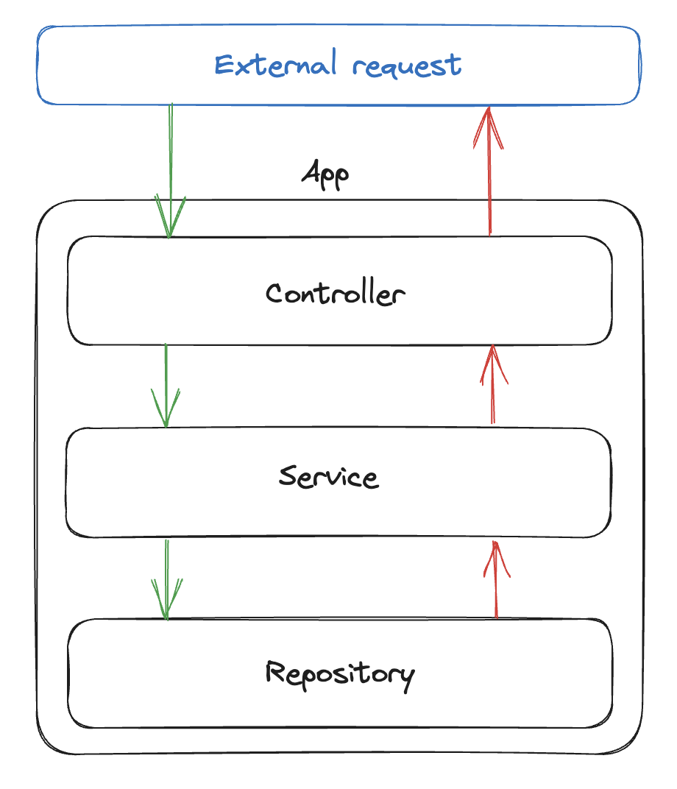

# About 🧑🏻‍💻

This repository contains a simple API that serves as a kickstart for new projects using FastAPI, SQLAlchemy and SQLite. It's built with a simple layered architecture, containing domain, service, repository and controller layers. With this layered architecture approach, it's possible to separate concerns and make the codebase more maintainable and scalable.

<p align="center">
  
</p>

It's also possible to add more layers if responsibilities grow within a specific layer. That being said, it's important to keep in mind that layers should be as independent as possible, and the dependencies should always point inwards, otherwise, could lead to ciclic dependencies mainly because of Pydantic schemas.

- Main frameworks and packages:
  - [FastAPI](https://fastapi.tiangolo.com/)
  - [SQLAlchemy](https://www.sqlalchemy.org/) ([SQLite](https://www.sqlite.org/) database).
  - [Alembic](https://alembic.sqlalchemy.org/) for migrations.
  - [rodi](https://github.com/Neoteroi/rodi) and [dishka](https://github.com/ragork/dishka) for dependency injection.

# How to run 🏃🏻‍♂️‍➡️

## Install Python

Install [Python](https://www.python.org/downloads/) (version 3.12).

## Set and activate virtual environment ⚙

In project folder, execute the following commands:

```bash
pip install uv
uv venv .venv
source .venv/bin/activate
```

## Set environment variables ⚙

Create a .env file with the required environment variables. See [.env.example](.env.example)

## Install required dependencies

Run the following installation command:

```bash
uv sync
```

## Run server 🚀

On virtual environment, execute:

```bash
python main.py
```

## Documentation 📚

While running the server, you can access the [API documentation](http://localhost:1337/api/docs).

## Development 🔧

### Linting and formatting

```bash
ruff check .
ruff format .
```

### Type checking

```bash
mypy .
```

### Running tests

```bash
pytest
pytest -v
```
